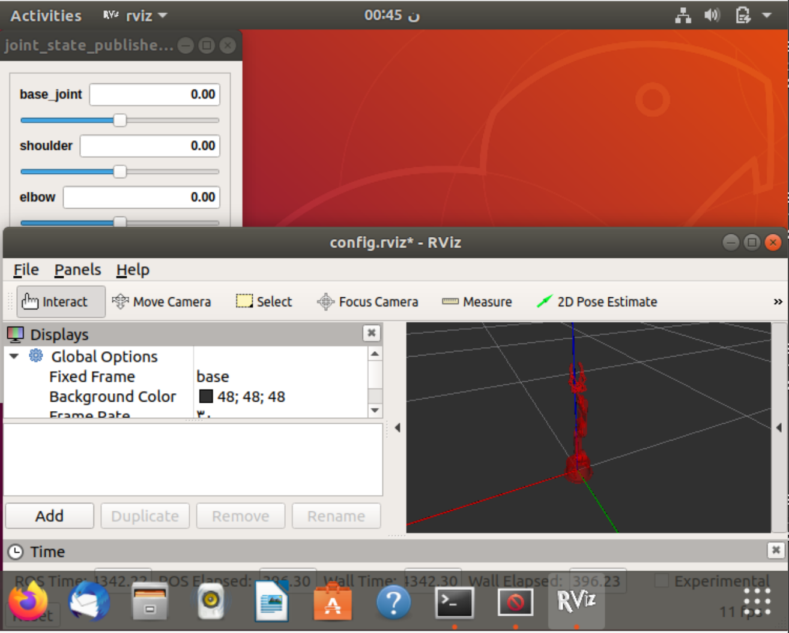

# install-robot-arm-pakage-in-ROS

Robot arm package installation steps
====================================
After installing the ROS in Ubuntu follow these steps to install the arm package:
1. Create a workspase with Catkin  ``` mkdir -p ~/catkin_pr/src ```
2. Go to the workspase ``` cd ~/catkin_pr ```
3. Install the package in the workspase 
```
 catkin_make
cd ~/catkin_pr/src
git clone https://github.com/smart-methods/arduino_robot_arm.git
```
4. After clone the packge go back to catkin_ra ``` cd .. ```
5. Install the follwing commands
```
rosdep install --from-paths src --ignore-src -r -y

sudo apt-get install ros-melodic-moveit

sudo apt-get install ros-melodic-joint-state-publisher ros-melodic-joint-state-publisher-gui

sudo apt-get install ros-melodic-gazebo-ros-control joint-state-publisher

sudo apt-get install ros-melodic-ros-controllers ros-melodic-ros-control
```
6. Go to bashrc folder 
```
sudo nano ~/.bashrc

# at the end of the (bashrc) file add the follwing line
source /home/ruba/catkin_pr/devel/setup.bash # write your own path 
then 
ctrl + o then ctrl+ x

source ~/.bashrc
```
7. Launch the package ``` roslaunch robot_arm_pkg check_motors.launch ```




https://user-images.githubusercontent.com/85648404/127786859-55eb34b9-6a9f-4ae0-86dc-2ff88aefbeca.mov
